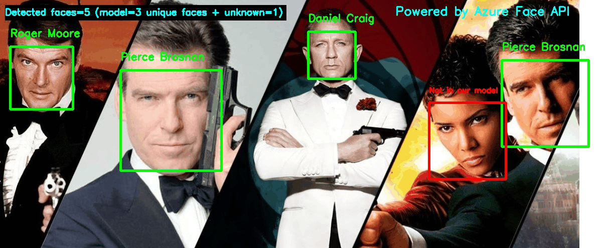

# Azure Face API Identification and Recognition demo

Important: https://docs.microsoft.com/en-us/azure/cognitive-services/computer-vision/overview-identity

**The Azure Face service provides AI algorithms that detect, recognize, and analyze human faces in images**. Facial recognition software is important in many different scenarios, such as identity verification, touchless access control, and face blurring for privacy.

You can use the Face service through a client library SDK or by calling the REST API directly.

**Face identification** can address "one-to-many" matching of one face in an image to a set of faces in a secure repository. Match candidates are returned based on how closely their face data matches the query face. This scenario is used in granting building or airport access to a certain group of people or verifying the user of a device.

**The verification** operation answers the question, "Do these two faces belong to the same person?". Verification is also a "one-to-one" matching of a face in an image to a single face from a secure repository or photo to verify that they're the same individual. Verification can be used for Identity Verification, such as a banking app that enables users to open a credit account remotely by taking a new picture of themselves and sending it with a picture of their photo ID.

